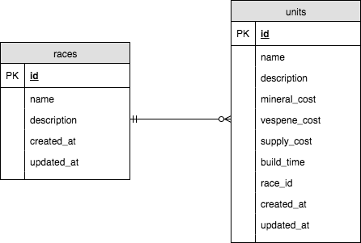
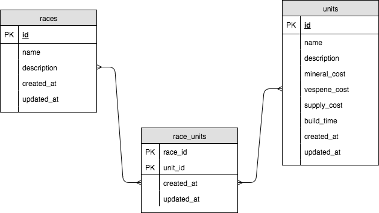

# StarCraft: Python Expansion

Today we'll be building an API for the greatest game ever created: [StarCraft](https://starcraft.com).

## Set Up Our Environment

**virtualenv** helps us to isolate the version of Python and libraries required on a project basis.

If you haven't already, [install virtualenv](http://flask.pocoo.org/docs/0.12/installation/)

Create a new **virtualenv** for our project.

```bash
$ mkdir starcraft_python && cd starcraft_python
$ virtualenv venv
```

Activate the project

```bash
$ . venv/bin/activate
```

## Set Up Flask

```bash
$ pip install Flask
```

Create our application file

```bash
$ touch main.py && atom main.py
```

Add our Flask initialization code

```python  
# main.py
from flask import Flask
app = Flask(__name__)

@app.route('/')
def index():
    return 'StarCraft: Python Extension'

# If this file is being run directly, then start Flask
if __name__ == '__main__':
    app.run(debug=True)
```

Run the development server

```bash
$ export FLASK_APP=main.py
$ export FLASK_DEBUG=1
$ flask run
 * Serving Flask app "app"
 * Forcing debug mode on
 * Running on http://127.0.0.1:5000/ (Press CTRL+C to quit)
 * Restarting with stat
 * Debugger is active!
```

> Setting `FLASK_DEBUG=1` enables logging and automatic restarts

## Create Routes

```
GET /races
GET /races/<race_name>
GET /races/<race_name>/units
GET /units
POST /units
GET /units/<unit_id>
```

```python
# main.py
from flask import Flask
app = Flask(__name__)

@app.route('/', methods=['GET'])
def index():
    return 'StarCraft: Python Expansion'

@app.route('/races', methods=['GET'])
def races():
    return 'List all races'

@app.route('/races/<race_name>', methods=['GET'])
def races_name(race_name):
    return 'Display details for %s' % race_name

@app.route('/races/<race_name>/units', methods=['GET'])
def races_units(race_name):
    return 'List all units for %s' % race_name    

@app.route('/units', methods=['GET', 'POST'])
def units():
    if request.method == 'POST':
        return 'Save new unit'
    else:
        return 'List all units'

@app.route('/units/<int:unit_id>', methods=['GET'])
def units_id(unit_id):
    return 'Display details for unit ID: %i' % unit_id

# If this file is being run directly, then start Flask
if __name__ == '__main__':
    app.run(debug=True)
```

## ERD's

Below might be our first attempt at designing a schema for our database.



Thinking through the units though, we realize we have a problem. One of the heroes in StarCraft named Kerrigan was originally a member of the Terrans but is now loyal to Zergs. We should reflect that she could be considered a member of both.

What we need is a link or join table, to allow for the same unit to be associated with multiple races. Since there should never be multiple instances of a `race_id` being paired with a `unit_id`, we could create a composite key using both.



## Create Our Database

From the command line, open up the interactive terminal for Postgres

```bash
$ psql
```

Create a new database

```
# CREATE DATABASE starcraft_python;
```

Connect to the database

```
# \c starcraft_python
```

View the tables and relations. There's nothing there yet, we'll fix that now.

```
# \dt
```

## Create Our Database User

```
# CREATE USER starcraft_dev WITH PASSWORD 'starcraftislife';
```

Check that our user was successfully created with the following command:

```
# \du
```

## Add dotenv

Our old friend `dotenv` is back, let's store our configuration values in here so we don't have to hardcode values into our code.

```bash
$ pip install python-dotenv
```

Keep our `.env` from being uploaded to GitHub.

```bash
$ echo '.env' >> .gitignore
```

Add the database configuration values for our development server in the root of your application.

```
# .env
DB_DRIVER=postgresql
DB_HOST=localhost
DB_USER=starcraft_dev
DB_PASSWORD=starcraftislife
DB_NAME=starcraft_python
```

The top of our `main.py` file will need the following code snippet to load the `.env` file and configuration values:

```python
# main.py

# ...
import os
from os.path import join, dirname
from dotenv import load_dotenv

dotenv_path = join(dirname(__file__), '.env')
load_dotenv(dotenv_path)
# ...
```

## Add SQL Alchemy

```bash
$ pip install flask-sqlalchemy
$ pip install psycopg2
```

## Saving Our Dependencies

We've now installed everything we need to for this application. Let's go ahead and save these dependencies for other developers that will need to know what they are in the future.

```bash
$ pip freeze > requirements.txt
```

## Create Models

Create a models folder that we can leverage as a package within our code.

Within the models folder, create an empty `__init__.py` file, and the following models as well: `race.py`, `unit.py`, `race_unit.py`

Your directory structure should look similar to the following now:

```
.
├── main.py
├── models
│   ├── __init__.py
│   ├── shared.py
│   ├── race.py
│   ├── race_unit.py
│   └── unit.py
├── requirements.txt
├── .env
```

```python
# models/shared.py
from flask_sqlalchemy import SQLAlchemy

db = SQLAlchemy()
```

```python
# models/race.py
from models.shared import db
import datetime

class Race(db.Model):
    __tablename__ = 'races'
    id = db.Column(db.Integer, primary_key=True)
    name = db.Column(db.String(100), unique=True, nullable=False)
    description = db.Column(db.Text)
    created_at = db.Column(db.DateTime, default=datetime.datetime.utcnow, nullable=False)
    updated_at = db.Column(db.DateTime)

    def __init__(self, name, description):
        self.name = name
        self.description = description

    def __repr__(self):
        return '<Race %r>' % self.name
```

```python
# models/unit.py
from models.shared import db
import datetime

class Unit(db.Model):
    __tablename__ = 'units'
    id = db.Column(db.Integer, primary_key=True)
    name = db.Column(db.String(100), unique=True, nullable=False)
    description = db.Column(db.Text)
    mineral_cost = db.Column(db.Integer)
    vespene_cost = db.Column(db.Integer)
    supply_cost = db.Column(db.Integer)
    build_time = db.Column(db.Integer)
    created_at = db.Column(db.DateTime, default=datetime.datetime.utcnow, nullable=False)
    updated_at = db.Column(db.DateTime)

    def __init__(self, name, description, mineral_cost, vespene_cost, supply_cost, build_time):
        self.name = name
        self.description = description
        self.mineral_cost = mineral_cost
        self.vespene_cost = vespene_cost
        self.supply_cost = supply_cost
        self.build_time = build_time

    def __repr__(self):
        return '<Unit %r>' % self.name
```

Note the foreign keys, which ensure that we don't have orphaned records from someone accidentally deleting a record that's still referenced from the race or unit tables.

```python
# models/race_unit
from models.shared import db
import datetime

class RaceUnit(db.Model):
    __tablename__ = 'race_units'
    race_id = db.Column(db.Integer, db.ForeignKey('races.id'), primary_key=True)
    unit_id = db.Column(db.Integer, db.ForeignKey('units.id'), primary_key=True)
    created_at = db.Column(db.DateTime, default=datetime.datetime.utcnow, nullable=False)
    updated_at = db.Column(db.DateTime)

    def __init__(self, race_id, unit_id):
        self.race_id = race_id
        self.unit_id = unit_id

    def __repr__(self):
        return '<RaceUnit race:%i unit:%i>' % (self.race_id, self.unit_id)
```

After adding SQL Alchemy and dotenv, the top of our `main.py` file will now look like this:

```python
# main.py
from flask import Flask
from flask_sqlalchemy import SQLAlchemy

import os
from os.path import join, dirname
from dotenv import load_dotenv

from models.shared import db
from models.race import Race
from models.unit import Unit
from models.race_unit import RaceUnit

dotenv_path = join(dirname(__file__), '.env')
load_dotenv(dotenv_path)

app = Flask(__name__)
app.config['SQLALCHEMY_DATABASE_URI'] = '%s://%s:%s@%s/%s' % (os.environ.get('DB_DRIVER'), os.environ.get('DB_USER'), os.environ.get('DB_PASSWORD'), os.environ.get('DB_HOST'), os.environ.get('DB_NAME'))

db.app = app
db.init_app(app)
db.create_all()
```

## Seed Data

Included is a seed file that we can run to optionally populate our database with some sample values.

```bash
$ python seed.py
```
